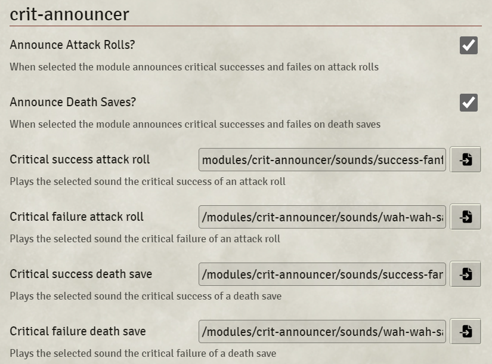

# crit-announcer
This module is a little hello-world type of module to play around a bit with FoundryVTT. 
The goal was to have custom sound effects for dnd5e games when the players get a critical success od failure on an attack roll or death save. 

## Compatibility
This module is designed to be used with the dnd5e System. As this is a beginner project I have not tested compatibility with any other module so far. 

## Settings

1. You can choose to toggle on the announcement of attack rolls and death saves independently form another
2. You can choose a different sound for any of the possible announcements by choosing a sound file 

# Credits and Attributions

## Sounds
Success Fanfare Trumpets.mp3 by FunWithSound -- https://freesound.org/s/456966/ -- License: Creative Commons 0
wah wah sad trombone.wav by kirbydx -- https://freesound.org/s/175409/ -- License: Creative Commons 0

## Thanks
Thanks to all the FoundryVTT module authors who do great work and who share it with all of us. I learned a lot simply looking into those repositories.  
