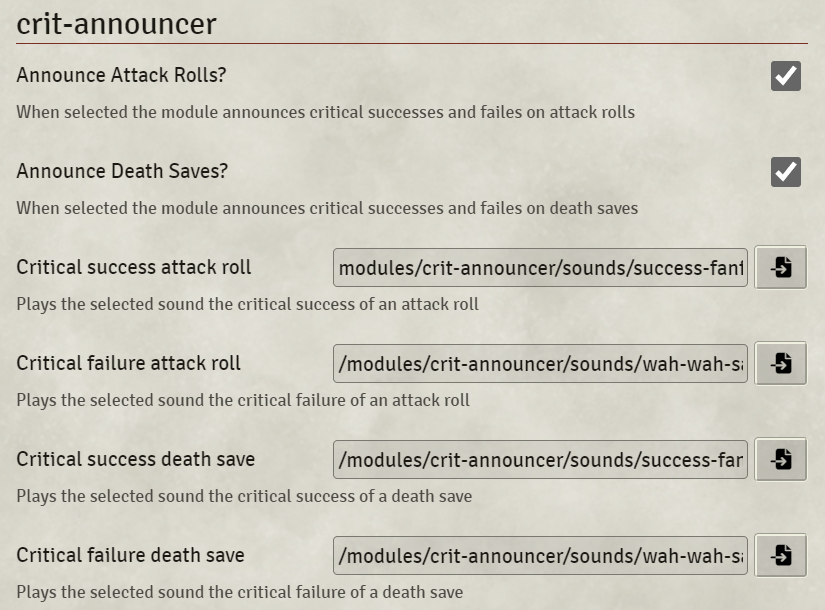

# crit-announcer
This module is a small hello-world type project to play around a bit with FoundryVTT.  
The goal was to have custom sound effects for DnD5e games when players get a critical success or failure on an attack roll or death save.

## Compatibility
This module is designed to be used with the DnD5e system.  
As this is a beginner project, I have not tested compatibility with any other modules so far.

## Settings

1. You can toggle the announcement of attack rolls and death saves independently from one another.
2. You can choose a different sound for any of the possible announcements by selecting a sound file.

# Credits and Attributions

## Sounds
- **Success Fanfare Trumpets.mp3** by FunWithSound — https://freesound.org/s/456966/ — License: Creative Commons 0  
- **Wah Wah Sad Trombone.wav** by kirbydx — https://freesound.org/s/175409/ — License: Creative Commons 0  

## Thanks
Thanks to all the FoundryVTT module authors who do great work and share it with the community.  
I learned a lot simply by looking into those repositories.
